# ⚛️ QEPlotter
> **Quantum ESPRESSO Band, DOS/PDOS, Fatband, and Analysis Toolkit**

[](https://www.python.org/downloads/)
[](https://github.com/shubics/QEPlotter)
[](https://github.com/shubics/QEPlotter/actions/workflows/tests.yml)
[](https://opensource.org/licenses/MIT)
[](https://qepweb.streamlit.app)
[](https://streamlit.io)

**QEPlotter** is a user-friendly Python library and GUI for post-processing Quantum ESPRESSO (QE) outputs.  
It provides a unified API to generate publication-ready plots (Bands, Fatbands, DOS) and robust tools for structure analysis and projection conversion.

---

## 🚀 Quick Start

### 1. Installation

```bash
git clone https://github.com/shubics/QEPlotter.git
cd QEPlotter
python -m venv .venv
source .venv/bin/activate
python -m pip install -e .
```

On Windows PowerShell, activate the environment with
`.venv\Scripts\Activate.ps1` instead.

### 2. Run the GUI Dashboard

The easiest way to use QEPlotter is via the interactive web dashboard:

```bash
python -m streamlit run gui_mod.py
```

> **Note:** QEPlotter 2.0 is implemented by `gui_mod.py` and the modular
> `qeplotter` package. The former monolithic script and GUI are preserved under
> [`archive/monolithic/`](archive/monolithic/) for older workflows.

---

## ✨ Features at a Glance

### 🖥️ **Web Dashboard (`gui_mod.py`)**
- **Instant Visualization**: Drag & drop standard QE output files (`bands.dat.gnu`, `scf.out`, `pdos`).
- **High-Res Static Plots**: Publication-quality images via Matplotlib.
- **Auto-Fermi Detection**: Automatically reads Fermi energy from `scf.out` (supports metals, insulators, and semiconductors).
- **Band Gap Annotation**: Detects VBM/CBM and draws an arrow with the gap value directly on the plot.
- **Smart Analysis Tools**: Built-in band gap detector, bilayer structure analyzer, and projection converters.
- **Crystal Structure Explorer**: Browser-rendered 3D structures with symmetry, bonds, angles, bilayer recognition, and ordered six-site TMD stacking analysis.
- **Native K-path Engine**: Built-in Bravais classification, first-Brillouin-zone construction, and QE-ready paths without SeeK-path.
- **Irreducible K-grid Engine**: Exact integer-orbit reduction, weights, full-grid mapping, 3D IBZ inspection, and QE export from structure symmetry.
- **Symmetry Representations**: Γ-point reducible characters, numerical irreducible decomposition, SALCs, and symmetry-allowed `s/p/d` orbital matching.

### 📦 **Python API**

#### **Modular Package ✅ (Recommended)**
The maintained API is provided by the structured `qeplotter/` package.
```python
from qeplotter import plot_from_file

plot_from_file(
    plot_type='fatbands',
    band_file='bands.dat.gnu',
    kpath_file='KPOINTS',
    fatband_dir='pdos_files/',
    fatbands_mode='atomic',
    spin=True
)
```

#### **Archived Standalone Script**
The former single-file API is retained at
[`archive/monolithic/qep.py`](archive/monolithic/qep.py). Its plotting API aims
to remain compatible where practical, but the modular package is canonical and
receives all new features and tests. For an older workflow that still requires
`import qep`, copy the archived file into that workflow's directory:

```bash
cp archive/monolithic/qep.py ./qep.py
```

```python
import qep

qep.plot_from_file(
    plot_type='fatbands',
    band_file='bands.dat.gnu',
    kpath_file='KPOINTS',
    fatband_dir='pdos_files/',
    fatbands_mode='atomic',
    spin=True
)
```

> **Note:** All examples below use the maintained modular package. Structure,
> K-path/K-grid, and symmetry tools are available only through the modular v2
> application.

## 📚 Documentation

- [Plotting API reference](docs/plotting-api.md)
- [Project layout and archive policy](docs/project-layout.md)
- [Irreducible k-grid engine](docs/irreducible-k-grid.md)
- [Symmetry and orbital representations](docs/symmetry-representations.md)
- [Bilayer stacking analysis](docs/stacking-analysis.md)

---

## 🔧 Core Capabilities & Technical Details

### 1. Band Structure Visualization
The library reads standard Quantum ESPRESSO `bands.x` output (`.gnu` format).

*   **Spin-Polarized Support**: When `spin=True`, fatband projection files with SOC/spin structure are parsed correctly. The `spin` flag is passed to the file reader for proper filename matching.
*   **Overlay Plotting**: The `overlay_band` mode superimposes two distinct band structures (e.g., *Bulk vs. Monolayer* or *PBE vs. HSE*). Handles disparate Fermi levels by aligning to 0 eV when `shift_fermi=True`.
*   **Band Gap Annotation**: When `show_band_gap=True`, automatically detects VBM/CBM and draws an arrow with the gap value. Supports SCF-based detection via `scf_file` for higher accuracy.

### 2. Fatbands (Projected Band Structure)
This is the library's most advanced feature, visualizing the contribution of specific atomic orbitals to the electronic bands. It parses filenames like `atm#1(Mo)_wfc#2(d)` to map weights to bands.

#### A. Visualization Modes
| Mode | Mechanism | Best For |
|:---|:---|:---|
| **Bubble** | Plots scatter markers where size $S \propto w_{orbital}$. Scaling is linear: $S = S_{min} + w(S_{max}-S_{min})$. | Quantitative analysis of contributions at specific k-points. |
| **Line** | Colors band segments based on weight using a `LineCollection`. | Clean, publication-quality plots where bubble clutter is undesirable. |
| **Heatmap** | Interpolates weights onto a dense grid using `imshow` (gaussian/bilinear interpolation). | Complex bands with high mixing (e.g., topological insulators). |

#### B. Grouping Logic
*   **`atomic`**: Sums all orbitals ($s, p, d, f$) belonging to a specific Atom ID (e.g., "Mo1").
*   **`orbital`**: Sums contributions by orbital type across *all* atoms (e.g., "Total d-character").
*   **`element_orbital`**: Granular breakdown (e.g., "Mo-d" vs "S-p").
*   **`sub_orb`**: If enabled, splits $d$ orbitals into $d_{z^2}, d_{x^2-y^2}, d_{xy}, d_{xz}, d_{yz}$. (Requires $m_j/m_l$ resolved data).

#### C. Layer-Resolved Plots
Useful for **Van der Waals heterostructures**.
*   **Input**: A dictionary mapping atom labels to `bottom` or `top`.
    *   *Example*: `{'W1': 'bottom', 'S4': 'bottom', 'Mo2': 'top'}`
*   **Process**: The code aggregates both layer projections and uses a continuous bottom → mixed → top colour scale.
*   **Material-aware labels**: The formulas at both colour-bar ends are inferred from the assigned atom labels (for example, `WS₂` and `MoS₂`) instead of showing generic Top/Bottom text.
*   **Auto-Detection**: The GUI can automatically assign layers from a structure file using PBC-aware median splitting and previews the inferred material formulas.

### 3. Density of States (DOS)
*   **Total DOS**: Reads standard `dos.x` output. Supports vertical orientation (Energy on Y-axis) for side-by-side comparison with bands.
*   **PDOS (Projected)**: Sums specific columns from `projwfc.x` output files grouped by `atomic`, `orbital`, or `element_orbital` mode.
*   **Side-by-Side DOS**: Band/fatband plots can include a Total DOS panel with `plot_total_dos=True`.

### 4. Advanced Analysis Tools

#### 🧭 Native K-path & Brillouin Zone
The modular GUI recommends band paths without a SeeK-path dependency. `spglib`
extracts the primitive cell and ASE supplies only the unimodular mapping to the
AFLOW canonical primitive basis. QEPlotter's internal Setyawan–Curtarolo registry
contains the named paths, extended Bravais cases, and lattice-dependent parameters
for all 14 three-dimensional Bravais lattices. The separate geometry engine builds
the first Brillouin zone as a reciprocal-lattice Wigner–Seitz cell using a Voronoi
construction; BZ vertices are never treated as band-path points. Both compact
`K_POINTS crystal_b` and explicit `K_POINTS crystal` cards can be downloaded.
Users can choose the full recommendation, its primary continuous branch, or
compose a custom route such as `Γ-X-M-Γ | R-X`; all exports and the 3D path update
to match the selected alternative.

The example below uses the included
[2H monolayer MoS₂ structure](examples/structures/MoS2_monolayer.vasp) and its
automatically selected conventional high-symmetry path.

<p align="center">
  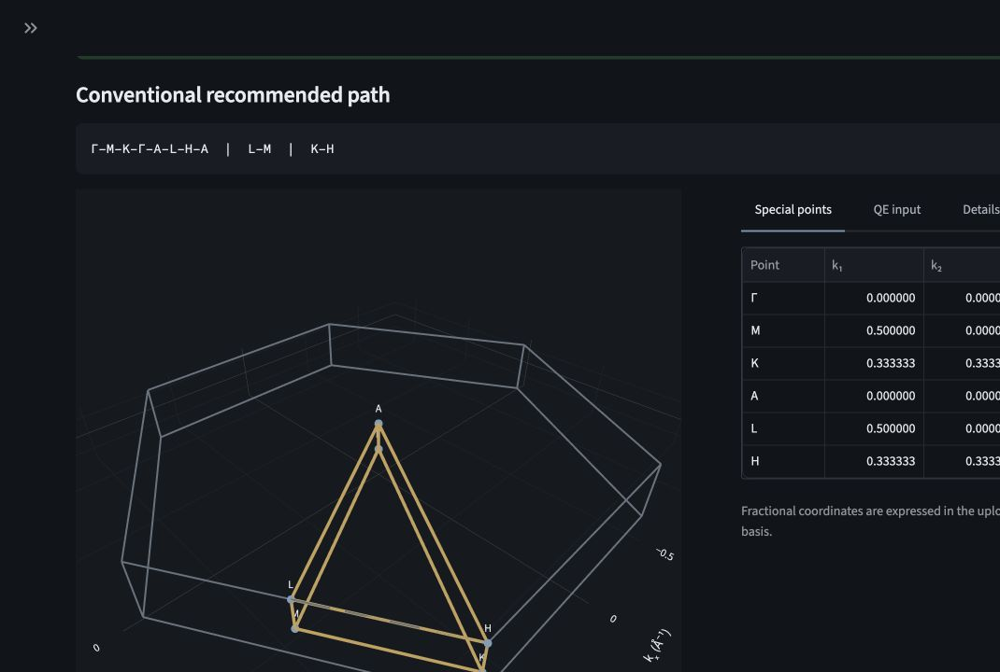
</p>

#### Irreducible K-grid
The separate **K-grid & IBZ** page reduces uniform SCF/NSCF meshes to
irreducible Brillouin-zone representatives with multiplicities, normalized
weights, complete orbit mapping, and QE-ready output. spglib supplies only the
crystal's spatial symmetry operations; QEPlotter performs the shifted-grid
compatibility checks and exact integer-address orbit reduction itself.

For the same MoS₂ structure, a `6 × 6 × 1` mesh is reduced to seven
irreducible k-points with normalized weights.

<p align="center">
  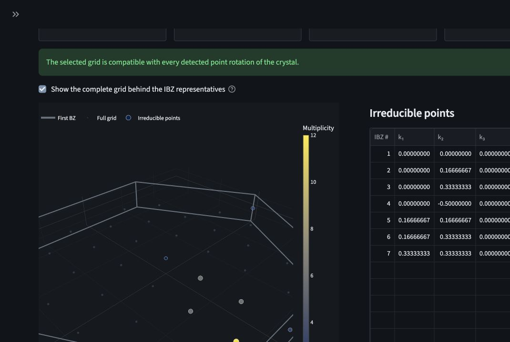
</p>

See [Irreducible k-grid engine](docs/irreducible-k-grid.md) for the algorithm,
coordinate convention, magnetic/time-reversal considerations, and validation
invariants.

#### Symmetry & Orbital Representations
The dedicated representations page standardises an uploaded structure to its
primitive cell, identifies complete Wyckoff/site-symmetry orbits, and constructs
the transformation matrices for `s`, `p`, `d`, or atomic-displacement bases at
Γ. QEPlotter derives the finite point-group irreducible characters numerically,
so every detected symmetry class is included. It then decomposes the selected
reducible representation, generates normalised symmetry-adapted linear
combinations (SALCs), and lists `s/p/d` targets that share an irrep and are
therefore allowed to interact by symmetry. The result is structure-derived;
assigning irreps to individual electronic bands additionally requires QE
wavefunctions and is intentionally reported as a separate future capability.

The screenshot shows the Mo d-orbital representation at Γ for the included
2H monolayer MoS₂ structure.

<p align="center">
  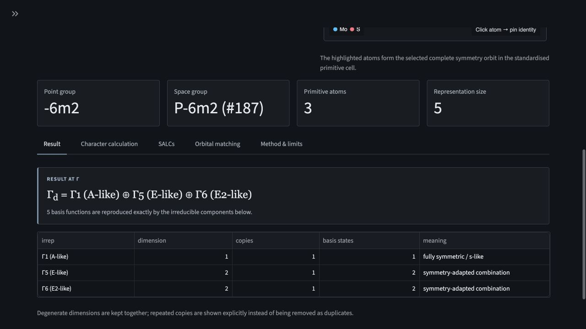
</p>

Example: for the four H `1s` orbitals in the tetrahedral CH₄ validation
structure, the complete 24-operation `T_d` analysis gives:

$$
\Gamma_{\mathrm{H\,1s}}=A_1\oplus T_2 .
$$

The automated suite also covers diamond Si, rocksalt NaCl, hcp Mg,
wurtzite ZnO, 2H monolayer MoS₂, and the finite-group engine for all 32
crystallographic point groups.

See [Symmetry and Orbital Representations](docs/symmetry-representations.md)
for the equations, basis conventions, SALC construction, validation table, and
scientific limits.

#### 🧊 Crystal Structure Explorer
The browser-based explorer reads common periodic structure formats, renders an
interactive 3D cell, and presents symmetry, bonds, angles, and bilayer stacking
in separate views. Atom identities can be pinned in the model, while Top,
Front, Right, and Left controls provide reproducible viewing directions.

<p align="center">
  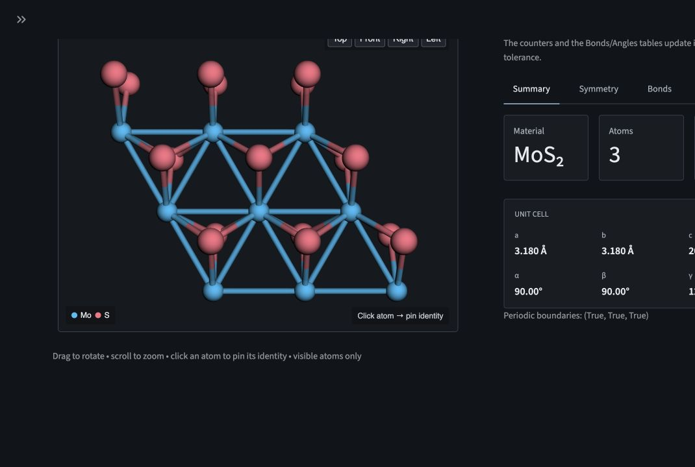
</p>

#### 🔍 Band Gap Detector
Two detection methods with automatic fallback:

1.  **SCF-Based** (`scf_file`): Parses `scf.out` to extract HOMO/LUMO levels directly. Most accurate for insulators and semiconductors.
2.  **Fermi-Level Based** (fallback): Scans band energies relative to $E_F$ to find VBM/CBM.

Detection output:
*   **VBM/CBM positions** (energy, k-point index)
*   **Gap type**: Direct ($k_{VBM} = k_{CBM}$) or Indirect ($k_{VBM} \ne k_{CBM}$)
*   **Plot annotation**: Arrow from VBM→CBM with $E_g$ label

#### 🧱 Structure Analyzer (`analyse_file`)
Parses `scf.in` or `scf.out` to determine 2D material properties:
*   **Stacking Order**: Safe detection of R-type AA/AB/BA and H-type AA′/AB′/A′B registries for commensurate trigonal-prismatic bilayers. Janus/heterobilayer interfaces remain explicit; unsupported or twisted structures are reported as `General registry`.
*   **Interlayer Distance**: Calculates the vertical ($\Delta z$) distance between defined layers.

Method, naming convention, applicability, and references:
[Bilayer stacking analysis](docs/stacking-analysis.md).

#### 🔄 Consistency Converters
Quantum ESPRESSO's `projwfc.x` has known quirks.
*   **`convert_consistent`**: Fixes the "varying rows" issue where projections with zero weight are omitted, breaking standard plotters. Forces a dense rectangular data grid.
*   **`convert_soc_proj_to_ml`**: For **SOC** runs. Converts from the $(j, m_j)$ coupled basis to the standard $(l, m_l)$ basis (e.g., $d_{xy}, d_{z^2}$) using Clebsch-Gordan coefficients.

---

## 📁 Supported Input Files

| File | Description | Source |
|------|-------------|--------|
| `*.bands.dat.gnu` | Band structure data | `bands.x` |
| `*.kpath` / `*.in` | High-symmetry k-points path (crystal_b) | Custom |
| `scf.out` | Self-consistent field output | `pw.x` |
| `proj.out` | Projections log | `projwfc.x` |
| `*_pdos*` | Projected DOS / fatband files | `projwfc.x` |
| `*.dos` | Total DOS file | `dos.x` |

---

For the complete `plot_from_file()` signature and parameter semantics, see the
[plotting API reference](docs/plotting-api.md).

---

## 🖼️ Plot Examples

### 1. Basic Band Structure

```python
from qeplotter import plot_from_file

plot_from_file(
    plot_type='band',
    band_file='molybden.bands.dat.gnu',
    kpath_file='molybden.kpath',
    fermi_level=6.234,
    shift_fermi=True,
    y_range=(-4, 6),
    band_mode='normal',
    spin=True
)
```

<p align="center">
  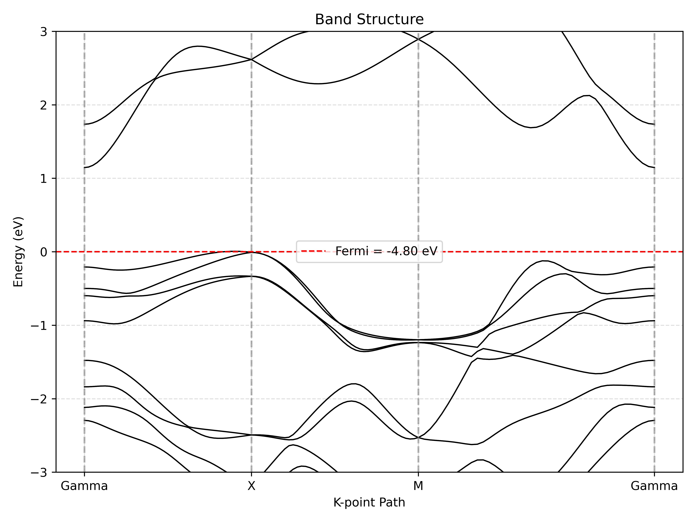
</p>

### 2. Band Structure with Band Gap Annotation

```python
from qeplotter import plot_from_file

plot_from_file(
    plot_type='band',
    band_file='Bi2Se3.bands.dat.gnu',
    kpath_file='Bi2Se3.kpath',
    fermi_level=-4.22,
    shift_fermi=True,
    y_range=(-3, 3),
    show_band_gap=True,                  # Annotate VBM/CBM with arrow
    scf_file='scf.out'                   # Use SCF data for accurate gap
)
```
<p align="center">
  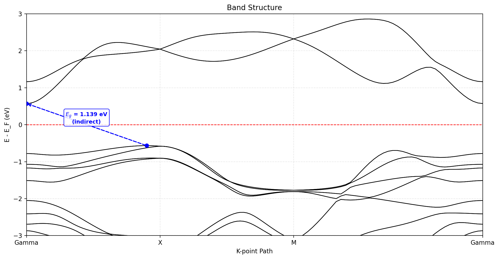
</p>
<p align="center">
  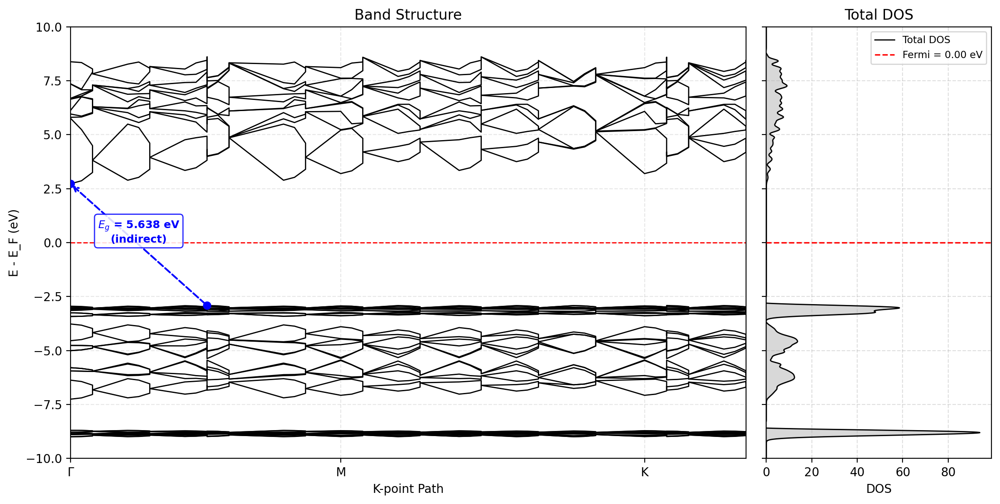
</p>


### 3. Fatbands: Atomic Contribution (Bubble Plot)

```python
from qeplotter import plot_from_file

plot_from_file(
    plot_type='fatbands',
    band_file='molybden.bands.dat.gnu',
    kpath_file='molybden.kpath',
    fatband_dir='./pdos_files',
    fatbands_mode='atomic',
    fermi_level=6.234,
    shift_fermi=True,
    s_min=1, s_max=150,
    spin=True
)
```

<p align="center">
  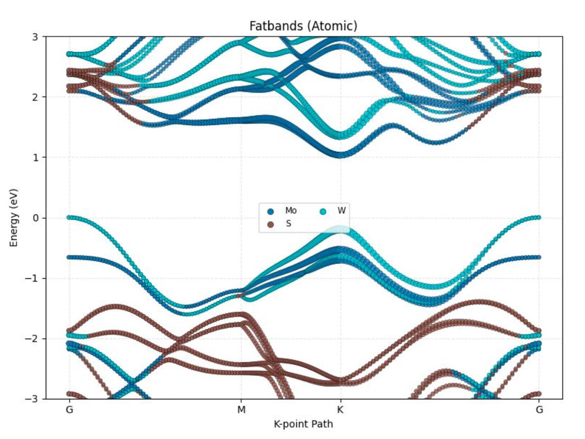
</p>

### 4. Fatbands: Element Heatmap

```python
from qeplotter import plot_from_file

plot_from_file(
    plot_type='fatbands',
    band_file='Bi2Se3.bands.dat.gnu',
    kpath_file='Bi2Se3.kpath',
    fatband_dir='./Bi2Se3_pdos',
    fatbands_mode='heat_orbital',
    highlight_channel='p',
    fermi_level=4.11,
    shift_fermi=True,
    cmap_name='inferno',
    heat_vmax=10.0,
    overlay_bands_in_heat=True
)
```

<p align="center">
  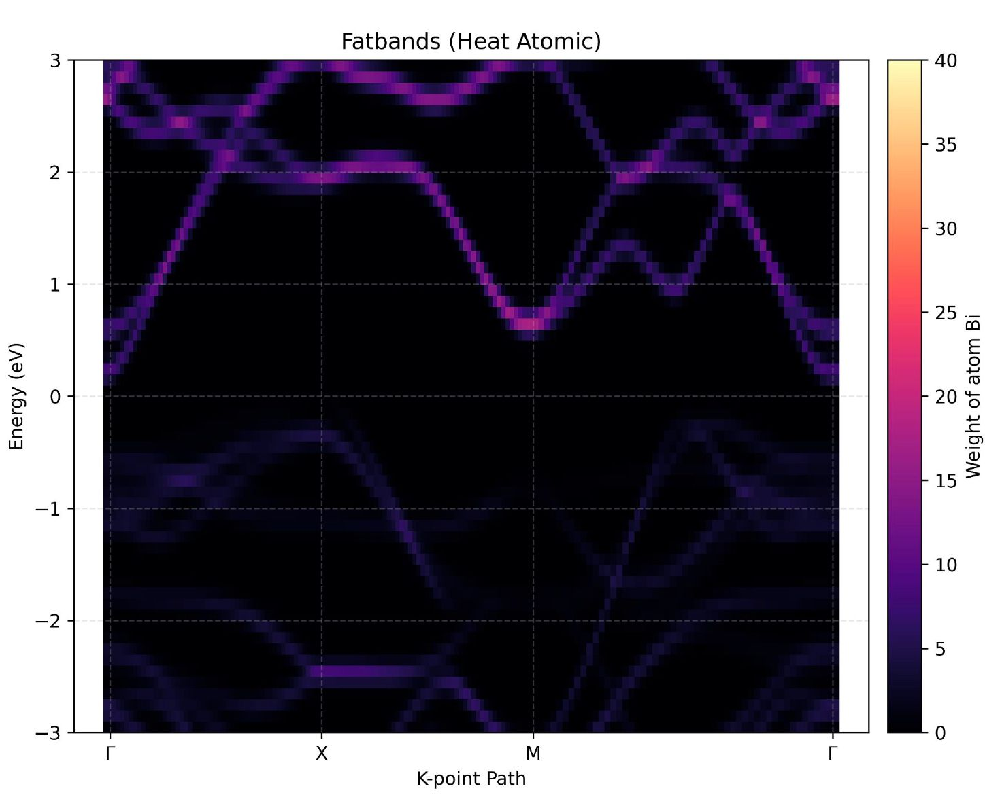
</p>

### 5. Element-Orbital Decomposition

```python
from qeplotter import plot_from_file

plot_from_file(
    plot_type='fatbands',
    band_file='MoS2.bands.dat.gnu',
    kpath_file='MoS2.kpath',
    fatband_dir='./pdos',
    fatbands_mode='element_orbital',
    fermi_level=1.5,
    weight_threshold=0.1,
    spin=False
)
```


### 6. Overlay Band Comparison

```python
from qeplotter import plot_from_file

plot_from_file(
    plot_type='overlay_band',
    band_file='MoS2_ML.bands.gnu',
    kpath_file='MoS2.kpath',
    label1='Monolayer', color1='red',
    band_file2='MoS2_Bulk.bands.gnu',
    kpath_file2='MoS2.kpath',
    label2='Bulk', color2='blue',
    fermi_level=5.0,
    shift_fermi=True
)
```

<p align="center">
  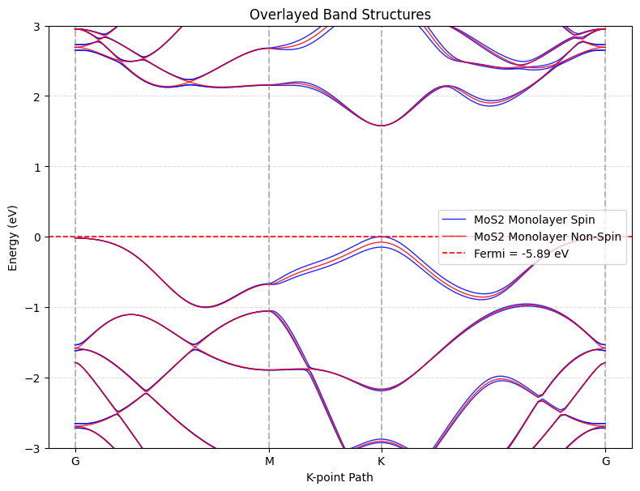
</p>

### 7. Layer-Resolved Fatbands

```python
from qeplotter import plot_from_file

layer_map = {
    'W1': 'bottom', 'S4': 'bottom', 'S6': 'bottom',
    'Mo2': 'top', 'S3': 'top', 'S5': 'top',
}

plot_from_file(
    plot_type='fatbands',
    band_file='examples/nsp_demo/inputs/nsp-aa.bands.dat.gnu',
    kpath_file='examples/nsp_demo/inputs/nsp.kpath',
    fatband_dir='examples/nsp_demo/inputs/nsp_pdos',
    fatbands_mode='layer',
    layer_assignment=layer_map,
    cmap_name='coolwarm',
    fermi_level=-5.33,
    shift_fermi=True,
    y_range=(-4, 4),
    data_note=(
        'Bundled QE-format example data · '
        'original calculation provenance not included'
    ),
)
```

The colour-bar endpoints are derived automatically from `layer_map`: `WS₂` at
the lower-layer end and `MoS₂` at the upper-layer end. The same material names
also appear in the plot title. For publication or scientific comparison, use
your own traceable QE outputs and record the calculation details in `data_note`.
This repository example is historical QE-format data whose original calculation
inputs are unavailable; see its [provenance note](examples/nsp_demo/README.md).

<p align="center">
  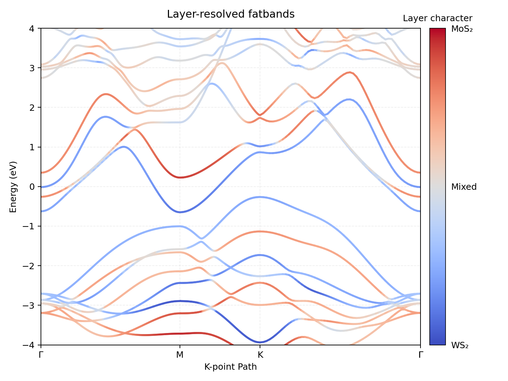
</p>

### 8. Total DOS

```python
from qeplotter import plot_from_file

plot_from_file(
    plot_type='dos',
    dos_file='system.dos',
    fermi_level=5.4,
    shift_fermi=True,
    vertical=True,
    savefig='dos_plot.pdf'
)
```

### 9. Projected DOS (PDOS)

```python
from qeplotter import plot_from_file

plot_from_file(
    plot_type='pdos',
    pdos_dir='./pdos',
    pdos_mode='element_orbital',
    fermi_level=5.4,
    shift_fermi=True
)
```

### 10. Band + DOS Side-by-Side with Gap

```python
from qeplotter import plot_from_file

plot_from_file(
    plot_type='band',
    band_file='data.gnu',
    kpath_file='path.kpath',
    fermi_level=0.0,
    shift_fermi=True,
    plot_total_dos=True,
    dos_file='system.dos',
    show_band_gap=True,
    scf_file='scf.out',
    dpi=300,
    savefig='figure_1.png'
)
```

---

## 📜 License

MIT © shubics
